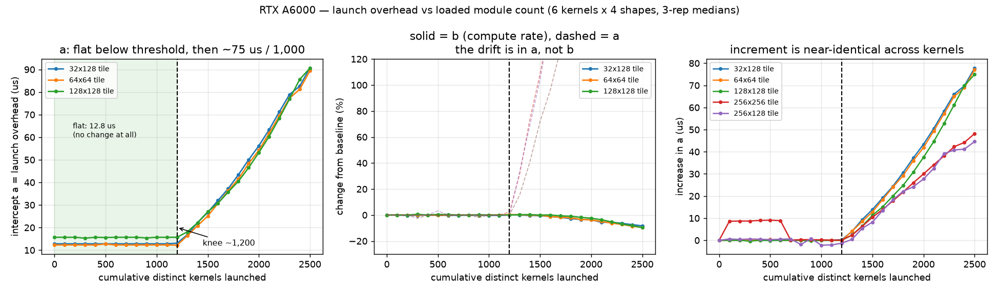

# 다중 시간 측정 드리프트 — RTX A6000

**요약.** 클럭을 고정하고 온도가 평형에 도달한 뒤에도, 같은 커널·같은 형상의
측정값이 7.5 시간에 걸쳐 **+5.06 %** 느려졌다. 열이 원인이라고 가정했고,
그 가정은 **실험으로 기각됐다.** 드리프트는 경과 시간이 아니라 **그 프로세스가
지금까지 실행한 서로 다른 커널의 누적 개수**를 따라간다.

이 문서는 관찰 → 잘못된 가설 → 기각 → 판별 실험 → 대책 순서로 적는다.
다른 GPU 에서 재측정할 때는 `docs/post_measurement.md` 10 절의 절차를
먼저 돌려야 한다 — **드리프트의 크기도 대책의 주기도 하드웨어에 의존한다.**


---

## 1. 관찰

Phase 3 본 측정 중 10 분마다 기준 config 하나를 재측정했다
(`sm86_tb128x64x32_w64x32x32_st6_swid8_a888`, 4096³, `results/drift.jsonl`).

| 경과 | ref (ms) | 드리프트 | 온도 |
|---:|---:|---:|---:|
| 0.8 분 | 2.8539 | — | 56 °C |
| 10.8 분 | 2.8534 | −0.02 % | 63 °C |
| 60.8 분 | 2.9123 | **+2.05 %** | 60 °C |
| 180.9 분 | 2.9723 | **+4.15 %** | 60 °C |
| 300.9 분 | 2.9941 | **+4.91 %** | 59 °C |
| 451.0 분 | 2.9982 | **+5.06 %** | 59 °C |

측정 조건은 그대로였다:

* SM 클럭 1350 MHz 고정, 메모리 클럭 7601 MHz (P2 상한) — 전 구간 변동 없음
* `clocks_event_reasons.active = 0x0` — 스로틀 없음
* 코어 온도는 **5 분이면 60 °C 부근에서 평형**, 이후 450 분 동안 ±3 °C
* 전력 150~230 W (A6000 한계 300 W)

즉 **온도는 진작 평평한데 성능은 계속 느려진다.** 재현성 자체는 좋았다
(같은 시점 반복 측정의 중앙값 편차 0.04 %). 느리게, 단조롭게, 확실하게
움직이는 신호다.

13 시간 유휴(46 °C) 후 재측정하면 +0.29 % 로 **완전히 되돌아온다.** 가역적이다.

## 2. 잘못된 가설 — 느린 열용량

첫 가설은 이랬다. *코어 온도는 5 분이면 평형이지만, 메모리 모듈이나 기판의
열용량은 훨씬 크다. 그쪽이 몇 시간에 걸쳐 달아오르면서 DRAM 타이밍이 조금씩
나빠지는 것이다.* 가역성(유휴 후 회복)도 이 가설에 잘 맞았다.

그래서 D-1 을 구현했다 — 본 측정 전에 **실부하로 소킹**하고, 온도가 아니라
기준 config 의 측정값 자체로 평형을 판정한다 (`scripts/rehearse.py` 의
`thermal_soak`).

### 기각

구현한 뒤 검증했다. **30 분간 69 °C / 230 W 로 소킹**했다 — Phase 3 정상
구간(60 °C / 155 W)보다 확실히 뜨겁고 전력도 높다. 열이 원인이라면 소킹 후
측정에서도 같은 상승 곡선이 나와야 한다.

**결과: −0.07 %.** 나오지 않았다.

가설이 틀렸다. 관찰은 맞았고 해석이 틀렸다.

| | 온도 | 전력 | 시간 | distinct 커널 | 드리프트 |
|---|---:|---:|---:|---:|---:|
| 소킹 (기준 config 반복) | **69 °C** | **230 W** | 30 분 | ~1 | **−0.07 %** |
| Phase 3 (실제 패턴) | 61 °C | 157 W | 10 분 | 1,556 | +0.50 %/10분 |

**더 뜨겁고 더 센 쪽이 드리프트가 없다.** 열로는 이 표를 설명할 수 없다.

그리고 이 표에는 답이 이미 들어 있었다. 소킹은 **기준 config 하나만
반복**한다 — 나도 모르는 사이에 "커널 수를 1 로 묶은 대조군" 을 돌린
것이었다. 그때는 온도만 보고 있어서 그 열을 읽지 못했다.

> 이때 내 실험 설계에 있던 결함도 같이 드러났다. "13 시간 유휴 후 회복"
> 실험은 **새 프로세스로** 측정했다. 그러면 냉각과 프로세스 재시작이 같이
> 일어나므로 회복의 원인을 냉각으로 돌릴 근거가 없었다. 가역성은 열의
> 증거가 아니라 **프로세스 상태의 증거**였을 수 있다.

## 3. 판별 — 무엇에 비례하는가

### 먼저 제거된 후보

드리프트는 **450 분 내내 단조 증가**한다. 그러니 일찍 포화하는 것은 원인일 수
없다. 이 기준만으로 대부분이 떨어져 나간다.

| 후보 | 실측 | 판정 |
|---|---|---|
| SM 클럭 | 1350 MHz, 전 구간 변동 없음 | ✗ |
| 메모리 클럭 | 7601 MHz, 전 구간 변동 없음 | ✗ |
| 스로틀 | `clocks_event_reasons.active = 0x0` 내내 | ✗ |
| 코어 온도 | 5 분에 평형, 이후 ±3 °C | ✗ |
| 열 축적 (느린 열용량) | 69 °C/230 W 소킹 후 −0.07 % | ✗ (2 절) |
| 버퍼 재할당 (`Buf::ensure`) | 고수위 방식. **10 분에 5 회 성장 후 정지** | ✗ |
| distinct 형상 | 66 개 전부 **10 분 안에** 등장 | ✗ |
| 누적 측정 행 | 시간에 선형(≈500 행/분)인데 드리프트는 아님 | ✗ |

남는 것은 둘이다 — **경과 시간**과 **누적 distinct 커널 수**.

### 남은 둘

| 후보 | 드리프트와의 상관 |
|---|---:|
| 경과 시간 | r = 0.886 |
| 누적 측정 행 수 (= 총 작업량) | r = 0.895 |
| **누적 distinct 커널 수** | **r = 0.991** |

Phase 3 안에서는 이 셋이 모두 단조 증가하므로 상관계수만으로는 못 가린다.
그래서 **곡선의 모양**과 **기울기의 안정성**을 본다.

누적 측정 행은 시간에 거의 선형이고(≈500 행/분) 드리프트는 시간에 선형이
아니다 — 작업량은 여기서 탈락한다. 반면 distinct 커널 수는 드리프트와
**같은 포화 곡선**을 그린다 (그림 오른쪽 패널).

기울기를 보면 더 분명하다.

| 구간 | 커널당 기울기 | 분당 기울기 |
|---|---:|---:|
| 21~31 분 | 1.15 m%/커널 | 0.0397 %/분 |
| 51~61 분 | 1.04 m%/커널 | 0.0287 %/분 |
| 111~121 분 | 0.66 m%/커널 | 0.0108 %/분 |
| 231~241 분 | 1.06 m%/커널 | 0.0072 %/분 |

**커널당 기울기는 ~1.1 × 10⁻³ %/커널로 거의 일정하고, 분당 기울기는 23 배
변한다.** 드리프트는 distinct 커널 수 1,556 개 지점부터 6,143 개까지
거의 완전한 직선이다 (그림 가운데 패널).

### 대조 실험 — 시간은 흐르되 커널은 늘지 않게

같은 셔플 구조로 모의 작업을 돌리되 **distinct 커널을 800 개 이하로 묶었다.**

| 경과 | 대조군 드리프트 | distinct 커널 | 같은 시각의 Phase 3 |
|---:|---:|---:|---:|
| 10 분 | +0.28 % | 427 | −0.02 % (1,556 커널) |
| 20 분 | +0.25 % | 599 | +0.50 % (1,976 커널) |
| 30 분 | +0.25 % | 694 | +0.90 % (2,321 커널) |
| 40 분 | +0.28 % | 749 | +1.47 % (2,666 커널) |
| 50 분 | +0.29 % | 778 | +1.76 % (2,945 커널) |
| **60 분** | **+0.25 %** | **790** | **+2.05 % (3,222 커널)** |

대조군은 초기에 +0.25 % 올라간 뒤 **60 분 내내 평평하다.** 시간은 똑같이
흘렀고 온도도 같았다(63~65 °C). 같은 경과 시간에 드리프트가 **8 배** 다르다.
다른 것은 그 프로세스가 지금까지 실행한 서로 다른 커널의 수뿐이다.

> 대조군의 +0.25 % 초기 상승은 Phase 3 의 곡선과 같은 직선 위에 있지 않다
> (Phase 3 는 커널 1,556 개에서 드리프트가 0 이었다). 즉 이 0.25 % 는
> 별개의 초기 과도 현상으로 보이며, 중요한 것은 **그 뒤로 더 오르지
> 않았다**는 점이다.

### 판별 실험 — 커널만 늘리고 시간은 흐르지 않게

대조군은 "시간은 흐르되 커널은 안 늘어나는" 쪽을 봤다. 반대쪽도 필요하다.

각 커널을 아주 작은 문제(256³)로 **한 번씩만 터치**하면 그 모듈의 디바이스
로드만 유발하고 넘어갈 수 있다. 그러면 몇 분 안에 수천 개를 건드린다.
`cudaMemGetInfo` 로 여유 메모리도 같이 기록했다.

| 경과 | 터치한 커널 | 드리프트 | 여유 메모리 | 온도 |
|---:|---:|---:|---:|---:|
| 0.0 분 | 0 | +0.00 % | 48,076 MB | 61 °C |
| 0.7 분 | 1,000 | +0.12 % | −144 MB | 52 °C |
| 1.9 분 | 2,000 | +0.81 % | −172 MB | 48 °C |
| 3.1 분 | 2,500 | +1.82 % | −186 MB | 47 °C |
| 3.8 분 | 2,750 | +3.65 % | −194 MB | 46 °C |
| 11.8 분 | 4,250 | +7.17 % | −234 MB | 44 °C |
| 13.6 분 | 4,500 | **+7.60 %** | −244 MB | **44 °C** |

**14 분 만에 +7.60 %.** Phase 3 은 같은 크기에 도달하는 데 7.5 시간이 걸렸고,
대조군은 60 분 동안 +0.25 % 였다. 경과 시간으로는 이 표의 어느 줄도 설명되지
않는다.

그리고 **온도는 61 °C → 44 °C 로 떨어지는 동안 드리프트가 올라갔다.** 터치가
256³ 짜리라 부하가 가벼워 GPU 가 식는데 성능은 계속 나빠진다. 두 변수가
**반대 방향**으로 움직인다 — 소킹 실험보다 강한 반증이다.

기전도 같이 잡혔다.

* **여유 메모리가 커널당 약 80 KB 씩 단조 감소한다.** 디바이스 모듈 로드의
  서명이다. 이 패턴을 만들 다른 것이 없다.
* **모듈 로드 자체가 느려진다.** 250 개를 터치하는 데 처음에는 0.17 분,
  4,250 개 지점에서는 1.66 분 — **9 배**. 모듈 테이블 조회가 O(n) 이거나
  할당이 단편화되고 있다는 뜻이다.

CUDA 12.4 는 모듈 로딩이 기본 **LAZY** 다. `rehearse.py` 는 6,285 개 `.so` 를
시작할 때 전부 dlopen 하지만, 그건 호스트 쪽 등록일 뿐이다. **디바이스에
모듈이 올라가는 것은 각 커널의 첫 런치 때 하나씩** 일어난다. 셔플된 루프가
진행될수록 누적되고, 그 수가 곧 드리프트다.

## 4. 편향은 균일하지 않다 — 이게 대책을 정한다

드리프트가 **모든 config 에 같은 비율**로 걸린다면 순위는 보존되고, 표는
쓸 수 있다. 그래서 커널 4 개 x 형상 3 개를 같이 쟀다.

터치 2,500 개 시점 (LAZY):

| 프로브 | 기준값 | 드리프트 |
|---|---:|---:|
| 작은타일 @512³ | 0.0154 ms | **+598.75 %** |
| 저smem @512³ | 0.0174 ms | +517.46 % |
| 큰타일/스필 @512³ | 0.169 ms | +30.91 % |
| 작은타일 @2048³ | 0.384 ms | +13.87 % |
| 큰타일/스필 @4096³ | 20.48 ms | +4.15 % |
| 코드최대/스필 @4096³ | 22.04 ms | +5.74 % |

**15 us 커널은 +599 %, 22 ms 커널은 +5.7 %.** 100 배 차이다. 균일하지 않다.

### 성분 분해

절대 증가량으로 보면 정체가 드러난다. 터치 2,500 → 3,500 사이의 증가분:

| 프로브 | 기준(ms) | 증가분 |
|---|---:|---:|
| 작은타일@512 | 0.0154 | +85 us |
| 작은타일@2048 | 0.384 | +42 us |
| 작은타일@4096 | 2.80 | +40 us |
| 큰타일@512 | 0.169 | +42 us |
| 큰타일@2048 | 2.29 | +43 us |
| 큰타일@4096 | 20.48 | +47 us |

기준값이 **1,400 배** 차이나는데 증가분은 거의 같다. 배수 편향이 아니라
**런치당 상수 오버헤드**다 — 모듈 1,000 개당 약 42 us.

상수이므로 긴 커널에서는 안 보이고 짧은 커널을 통째로 삼킨다. 터치 4,000 개
지점에서 512³ 프로브 네 개는 전부 0.23~0.28 ms 로 수렴한다 — 원래 시간이
0.015 ms 인 것도, 0.169 ms 인 것도. **그 시점의 512³ 측정은 커널이 아니라
런치 경로를 재고 있다.**

### 폐기 결정이 다시 정당화된다

Phase 3 의 드리프트 감시는 **4096³ 커널 하나**로만 했다. 그래서 +5.06 % 로
보였다. 같은 조건에서 512³ 측정은 수백 % 오염되어 있었고 **감시 지표에는
전혀 잡히지 않았다.** 감시 설계의 결함이다.

그래서 `DRIFT_SHAPES` 에 512³ 을 넣었다. 앵커 커널에도 짧은 커널을 반드시
포함한다 — 큰 커널만 쓰면 같은 실수를 반복한다.

### `CUDA_MODULE_LOADING=EAGER` 는 대책이 못 된다

두 가지 이유로 탈락했다.

1. **효과가 없었다.** dlopen 시간이 LAZY 와 같은 2.8 초였고(전부 미리
   올렸다면 훨씬 길어야 한다), 여유 메모리도 같은 속도로 줄었으며,
   드리프트도 거의 같았다 (터치 2,500 에서 +553 % vs LAZY +599 %).
   `Ctx` 를 dlopen 보다 먼저 만들어서 그 뒤 등록된 fatbin 은 여전히 지연
   로드된 것으로 보인다. 순서를 바꾸면 동작할 수도 있다 — 확인하지 않았다.
2. **동작했어도 쓸 수 없다.** EAGER 는 드리프트를 없애는 게 아니라 **처음부터
   최대 압력으로 고정**한다. 편향이 균일하면 그것도 괜찮지만, 위에서 봤듯이
   100 배 갈린다. 작은 형상의 config 순위가 통째로 왜곡된 표를 얻게 된다.

## 5. 대책 — 시간 분할 세그먼트

원인이 "누적 distinct 커널" 이므로 대책도 하나로 정해진다 — **한 프로세스가
로드하는 커널 수를 문턱 아래로 묶는다.** 프로세스를 다시 띄우면 완전히
리셋된다 (새 프로세스의 기준값이 항상 같은 값으로 돌아온다).

### 왜 순차 세그먼트가 아니라 라운드 로빈인가

커널을 세그먼트로 나눠 순서대로 돌면 이렇게 된다.

    세그먼트 0 (커널 0~499)    -> 전부 초반 3 시간에 측정
    세그먼트 12 (커널 6000~)   -> 전부 마지막 3 시간에 측정

세그먼트 인덱스가 시각과 완전히 상관되고, 세그먼트는 커널의 집합이므로
**커널 정체성이 시각과 상관**된다. 그건 전역 셔플이 막으려던 바로 그
편향이다. 모듈 압력은 리셋되지만 다른 시간 의존 변수가 있으면 그대로 노출된다.

커널을 바깥 루프로 두는 방식(한 커널 로드 후 형상 66 개를 다 재고 넘어감)도
같은 이유로 **더 나쁘다** — 첫 커널은 모듈 1 개 상태에서, 마지막 커널은 6,285 개
상태에서 측정된다. 모듈 압력이 커널 정체성과 완벽히 상관된다.

그래서 **라운드 로빈**으로 돈다. 각 라운드에서 모든 세그먼트를 조금씩
진행시키고, 세그먼트 순서도 라운드마다 다시 섞는다. 그러면 어느 커널의
측정도 33 시간 전체에 흩어진다.

### 설계

| 항목 | 값 | 이유 |
|---|---|---|
| 세그먼트 분할 | 무작위, 씨앗 고정 | id 순으로 자르면 세그먼트가 tile 크기 축과 상관되고 세그먼트 간 오차가 그대로 config 편향이 된다 |
| 세그먼트당 커널 | 500 | 문턱의 절반 이하 |
| 진행 배분 | **작업 수** (`--max-jobs`) | 세그먼트마다 커널 실행 시간 분포가 달라 시간 고정은 진행률이 어긋난다. 시간은 상한으로만 |
| 앵커 | 6 개, 모든 세그먼트에서 측정 | 세그먼트 간 계통 오차를 직접 잰다 |
| 앵커 기록 | `results/anchors.jsonl` **별도 파일** | `results.jsonl` 에 넣으면 같은 (커널, 형상) 을 13 번 재게 되어 중복 판정에 걸린다. 앵커는 표의 일부가 아니라 측정 조건의 기록이다 |
| 감시 프로브 | 512³ + 4096³ | 큰 형상 하나로는 오염을 못 본다 |

```bash
python3 scripts/sweep.py --dry-run     # 계획
python3 scripts/sweep.py               # 전체
python3 scripts/check_anchors.py       # 세그먼트 간 편차 판정
```

`segments` 설정은 `env.json` 에 기록되어 **`env_hash` 에 들어간다.** 세그먼트
크기가 다른 데이터는 측정 조건이 다른 데이터이므로 섞으면 안 된다.

### 비용

| 구성 | 재시작 | 측정 | 재시작 비용 | 합계 | 오버헤드 |
|---|---:|---:|---:|---:|---:|
| N=500, 8 라운드 | 104 회 | 32.6 h | 1.2 h | **33.8 h** | 3.4 % |
| N=500, 6 라운드 | 78 회 | 32.6 h | 0.9 h | 33.5 h | 2.6 % |
| N=300, 6 라운드 | 126 회 | 32.6 h | 1.4 h | 34.0 h | 4.1 % |

재시작 1 회는 CUDA 초기화 2 초 + dlopen 0.5 초 + 재개용 `results.jsonl`
파싱 6 초(98 만 행 실측) + 워밍업 30 초 ≈ 40 초다.

### 문턱은 어디인가 — `a` 와 `b` 를 분리해서 잰다

커널 6 개를 4 개 형상(256³~2048³)에서 재고 `t = a + b·work` 를 맞췄다.
`a` 는 일을 0 으로 보냈을 때 남는 시간 = 런치 오버헤드, `b` 는 계산 처리율의
역수다. 모듈 누적이 런치 경로에 작용하면 `a` 만 커지고 `b` 는 그대로여야 한다.



| 터치 | a (32x128) | a (64x64) | a (128x128) | b (32x128) |
|---:|---:|---:|---:|---:|
| 0 | 12.8 us | 12.3 | 15.7 | 21.60 |
| 500 | 12.8 | 12.7 | 15.6 | 21.60 |
| 1,000 | 12.8 | 12.3 | 15.7 | 21.54 |
| **1,100** | **12.8** | **12.3** | **15.7** | 21.54 |
| 1,200 | 13.1 | 12.2 | 15.7 | 21.64 |
| **1,300** | **16.8** | **16.4** | **18.1** | 21.60 |
| 1,500 | 26.7 | 25.1 | 27.0 | 21.49 |
| 2,000 | 56.2 | 54.2 | 53.2 | 20.83 |
| 2,500 | 90.7 | 89.4 | 90.6 | 19.81 |

세 가지가 확정됐다.

1. **문턱 아래는 진짜 0이다.** STEP=100 해상도에서 1,100 개까지 `a` 가
   12.8 us 에서 **소수점 한 자리도 움직이지 않는다.** 노이즈에 묻힌 증가가
   아니라 변화가 없다.
2. **문턱은 커널과 무관하다 — ~1,200 개.** 타일 크기도 스레드 수도 smem 도
   다른 커널 다섯이 1,200 → 1,300 구간에서 **동시에** 꺾인다. 커널 속성이
   아니라 **드라이버 자료구조 용량**이라는 뜻이다.
3. **드리프트는 `a` 에만 있다.** 문턱 위에서 `a` 는 12.8 → 90.7 us (7 배)
   로 자라는데 `b` 는 21.60 → 19.81 (−8 %) 로 거의 그대로다. 계산 처리율은
   멀쩡하고 런치 경로만 나빠진다.

문턱 위 기울기는 1,000 개당 약 **75 us**다 (biastest 에서 독립적으로 얻은
42 us/1,000 과 같은 자릿수. biastest 는 형상별 상대값에서, 여기는 절편에서
얻었다).

증가분은 커널 사이에서 거의 같다:

| 커널 | a (0 → 2,500) | 증가분 |
|---|---|---:|
| 32x128 | 12.8 → 90.7 | +77.9 us |
| 64x64 | 12.3 → 89.4 | +77.1 us |
| 128x128 | 15.7 → 90.6 | +74.9 us |
| 256x256 | 85.7 → 133.9 | +48.2 us |
| 256x128 | 73.8 → 118.4 | +44.6 us |

작은 타일 셋은 서로 4 % 안쪽이고, 큰 타일 둘은 그 60 % 수준이다.

> **주의 — 큰 타일의 `a` 절대값을 런치 오버헤드로 읽으면 안 된다.**
> 256x256 타일로 256³ 문제를 풀면 스레드블록 하나가 전체를 처리한다.
> 0.096 ms 는 실제 계산 시간이지 오버헤드가 아니며, 직선 적합이 그
> **타일 양자화 낭비를 절편으로 흡수**한다. 증가분(Δa)은 그 상수가
> 상쇄되므로 의미가 있지만, 절대값은 아니다.

### 스필이 아니라 타일 크기가 축이다

문턱 위에서 `a` 증가분이 커널마다 1.5 배쯤 갈린다. 저증가 커널이 모두
스필 커널이라 "스필 커널은 로컬 메모리 지연이 커서 런치 오버헤드가 가려진다"
는 가설이 가능했다. **같은 타일에 스필만 다른 쌍**으로 갈랐다.

| 커널 | 스필 | 타일 | Δa (터치 0 → 2,000) |
|---|---:|---|---:|
| 32x128 | 0 | 작음 | **+41.3 us** |
| 64x64 | 0 | 작음 | **+40.6 us** |
| 128x256 | **0** | 큼 | **+31.0 us** |
| 128x256 | 있음 | 큼 | +30.3 us |
| 256x128 | 3052 | 큼 | +27.8 us |
| 256x256 | 1840 | 큼 | +26.6 us |

**같은 128x256 타일에서 스필 유무 차이가 +31.0 vs +30.3 — 사실상 없다.**
스필 없는 큰 타일이 작은 타일(+41)이 아니라 큰 타일 그룹(+27~30)에 붙는다.
축은 **타일 크기**이고 스필은 무관하다.

256³ 문제에서 CTA 수가 32x128 은 16 개, 128x256 은 2 개, 256x256 은 1 개다.
증가분이 CTA 수와 단조 증가한다 — 런치 경로 비용이 CTA 디스패치와 관련된다는
해석과 맞는다 (비례하지는 않는다).

> **같은 구조가 측정 노이즈에도 있다.** `core/noise.py` 의 재현성 모델이
> `sigma_abs / t + sigma_rel` 인데, 앵커에서 잰 절대 지터가 커널 시간과
> 무관하게 0.26~0.47 us 로 나온다. 여기 드리프트의 **런치당 상수
> 42 us/1,000 모듈** 과 같은 모양이다 — 둘 다 **고정 비용이 짧은 커널을
> 지배**하는 현상이고, 원인도 같은 자리(런치 경로)다.
>
> 그래서 짧은 커널은 두 번 불리하다: 드리프트에 더 크게 흔들리고,
> 재현성도 더 나쁘다. 0.5 ms 아래에서는 1 % 차이를 구분할 수 없다.

> **소비 쪽(kernelrule)이 알아야 할 것.** 모듈 압력이 문턱을 넘은 상태에서
> 측정된 데이터라면 **작은 타일 커널이 큰 타일보다 ~1.4 배 불리하게** 측정된다.
> 같은 형상에서 config 순위가 큰 타일 쪽으로 기운다. 세그먼트를 문턱 아래로
> 유지한 데이터에는 해당되지 않는다 (증가분이 전부 0).

### 그래서 세그먼트 크기는 500

문턱 1,200 의 42 % 다. 그 지점에서 `a` 증가는 측정 한계 이하(0.0 us)다.
문턱에 가깝게 잡으면 재시작이 줄지만, 문턱이 날카로워서 넘는 순간 급격히
나빠지므로 여유를 둔다.

## 6. 곁가지 — 측정 시간은 GPU 속도에 거의 비례하지 않는다

드리프트를 조사하다 나온 부수적 관찰인데, 다른 GPU 일정을 잡을 때 필요하다.

**작업당 벽시계 98 ms** (3 시간 검증 실측). 그 안에서 실제로 재는 커널이
차지하는 비중은 작다.

| 항목 | 추정 | 비중 |
|---|---:|---:|
| 워밍업 | 35.8 ms | 36.5 % |
| 측정 반복 | 28.7 ms | 29.3 % |
| `run_once` + `max_rel_error` + sync 3 회 + 파이썬/ctypes/JSON | ~32 ms | 32.7 % |
| `prepare_problem` (cuBLAS 참조 1.3 + 메모리 0.2) | 1.5 ms | 1.5 % |

(앞의 셋은 커널별 실측 속도로 세운 모델이고 마지막은 대역폭/피크에서 계산했다.
합이 실측과 정확히 맞지는 않지만 자릿수와 순서는 믿을 만하다.)

세 가지가 눈에 띈다.

1. **워밍업이 가장 크다.** `min_warmup = 10` 이라 느린 커널은 워밍업만
   자기 실행시간의 10 배를 쓴다. 프로토콜 시간 분포가 p50 26 ms, p90 132 ms,
   p99 491 ms 로 **느린 꼬리가 평균(64.5 ms)을 지배**한다.

   > **다음 캠페인에서 개선할 것.** 워밍업을 반복 횟수가 아니라 **시간
   > 예산**으로 바꾸면 꼬리가 크게 준다 (`min_warmup` 대신
   > `min_warmup_ms`). 지금은 건드리지 않는다 — 측정 조건이라 `env_hash`
   > 가 바뀌고, A6000 캠페인 중간에 바꾸면 앞뒤 데이터를 섞을 수 없다.
   > 4090 측정은 어차피 새 캠페인이므로 그때 적용하면 된다.
2. **`prepare_problem` 은 1.5 ms 로 무시할 만하다.** 형상이 같으면 조기
   반환하는데 전역 셔플에서 연속 두 작업의 형상이 같을 확률은 1/66 = 1.5 %
   이므로 사실상 매번 전체 경로를 탄다. 그래도 작다 — 셔플의 대가는 싸다.
3. **약 1/3 은 GPU 와 무관한 고정 비용**이다 (동기화, ctypes, JSON 기록).

그래서 **더 빠른 GPU 로 옮겨도 전체 측정 시간은 그만큼 줄지 않는다.**
4090 이 1.6 배 빠르다고 하면 프로토콜 부분만 64.5 → 40 ms 로 줄어 작업당
98 → 74 ms, 전체로는 25 % 단축에 그친다. 33 시간이 25 시간이 되는 정도다.
일정은 GPU 성능이 아니라 **작업 수**로 잡는 편이 맞다.

따라서 더 빠른 GPU 한 대보다 **여러 GPU 에서 병렬로 도는 편**이 낫다.
각 GPU 는 자기 `env_hash` 로 독립적으로 돌고, 번들이 조건을 들고 다니므로
나중에 합치는 데 문제가 없다.

> ⚠️ **다만 같은 서버의 여러 GPU 를 동시에 돌리기 전에 간섭 실험을 먼저
> 하라.** PCIe 대역폭, 호스트 메모리 대역폭, CPU 코어를 공유한다. 측정
> 루프의 3 분의 1 이 호스트 측 고정 비용(동기화, ctypes, JSON 기록)이라
> 특히 그렇다.
>
> 실험: GPU 하나만 돌릴 때와 둘을 동시에 돌릴 때 **같은 앵커의 측정값이
> 달라지는가.** 달라지면 순차로 돌아야 하고, 그러면 병렬의 이점이 사라진다.
>
> 이 저장소에서 실제로 겪었다 — `knee.py` 를 실수로 두 개 띄웠더니 같은
> 측정의 노이즈가 눈에 띄게 커졌다 (`knee-contended.log`). 그건 같은 GPU 를
> 공유한 경우지만, 호스트 자원 공유만으로도 비슷한 일이 생길 수 있다.

## 7. 다른 GPU 에서는

이 문서의 수치는 **A6000 전용이다.** 1.1 m%/커널 도, 6,285 개라는 커널 수도,
+5 % 라는 총량도 그대로 옮겨 쓸 수 없다. 새 GPU 에서 Phase 3 를 켜기 전에
`docs/post_measurement.md` 10 절의 드리프트 프로파일(2~3 시간)을 먼저 돌리고,
거기서 나온 값으로 대책 주기를 정한다.

건너뛰면 어떻게 되는지는 이미 안다 — A6000 에서 **226,211 행(전체의 23 %)을
버렸다.**

---

## 8. 왜 이제까지 안 보였나

대부분의 GPU 벤치마크는 **커널 몇 개를 몇 분** 돌린다. 그 범위에서는 이
현상이 보이지 않는다 — 커널 1,500 개 아래에서는 드리프트가 0 이었고,
대조군은 커널 800 개로 60 분을 돌아도 +0.29 % 에서 평평했다.

이 현상이 드러나려면 **수천 개의 서로 다른 커널을 한 프로세스에서 순회**해야
한다. 그건 정확히 오토튜닝 데이터 수집의 모양이다. 그리고 CUDA 12.x 의 LAZY
모듈 로딩은 시작 시간과 메모리를 아끼려는 최적화인데, 이 워크로드는 그
최적화가 상정한 패턴이 아니다 — 모듈을 올리기만 하고 거의 내리지 않는다.

즉 **이 조건은 오토튜닝 데이터 수집에서만 성립한다.** 그렇다면 기존 오토튜닝
데이터셋들도 같은 오염을 안고 있을 가능성이 있다. 측정 순서에 상관된 편향은
"먼저 측정된 config 가 이긴다" 는 형태로 나타나므로, 셔플을 했더라도 각
config 의 절대 시간에는 남는다.

다만 이건 **A6000 한 대에서 관찰한 것이고, 다른 하드웨어·드라이버·프레임워크로
일반화하려면 재현이 필요하다.** 여기서는 가능성을 기록만 해 둔다.


---

# 부록 — RTX 5090 / CUDA 13.3 (2026-08-28)

**드리프트는 있다. 다만 문턱이 A6000 의 4 배다.**

| | A6000 / 12.4 | A6000 / 13.3 | **RTX 5090 / 13.3** |
|---|---:|---:|---:|
| 문턱 (모듈) | 1,154 | 962 | **4,040** |
| 기울기 (us / 1,000 모듈) | 77.4 | 50.6 | **117.9 / 107.8** |
| 왜곡 배율 | — | — | **110.9 / 94.0** |
| 권장 세그먼트 | 461 | 384 | **1,616** |
| 기준선 `a` | 16.7 us | 130.6 us | **17.33 us** (sigma 0.18) |

두 번 쟀고 **문턱이 4,040 으로 완전히 같았다** (폭 0). 기울기와 왜곡 배율은
실행 간 편차가 있다 (117.9/107.8, 110.9/94.0) — 문턱 위 구간의 표본이
적어서다. 세그먼트를 정하는 데 쓰는 것은 문턱이므로 문제되지 않는다.

## ⛔ 첫 시도는 드리프트를 못 봤다 — 그리고 그것이 맞는 동작이었다

`--max-touch 3000` 으로 돌린 첫 실행은 **2,625 모듈까지밖에 못 갔고**
(터치 실패 12.5 % 때문), 그 구간에서 `a` 는 17.33~17.80 us 로 완전히
평평했다. 문턱이 4,040 이니 당연하다.

스크립트는 **"드리프트가 없다" 고 보고하지 않고 종료 코드 4 로 거부했다:**

```
⚠️ 문턱을 찾지 못했다. 둘 중 하나다:
   (a) 이 GPU/CUDA 조합에는 드리프트가 없다 — --max-touch 를 늘려 확인하라
   (b) 압력을 충분히 올리지 못했다 (최대 2625 모듈)
   **드리프트가 없다고 단정하지 마라.**
```

**(b) 가 맞았다.** A6000 기준(문턱 962)에 맞춰 `--max-touch 3000` 이 넉넉하다고
생각했는데, 이 GPU 에서는 부족했다. 만약 "없음" 으로 결론냈다면 세그먼트를
키우거나 아예 없앴을 것이고, 그러면 전수 후반이 통째로 오염된다.

**새 환경에서는 `--max-touch` 를 커널 풀이 허용하는 최대까지 밀어라.**
5090 에서는 7,000 (실 도달 6,122) 이었다.

> ⛔ **`--max-touch` 를 옛 환경의 문턱에 맞춰 잡지 마라.** 문턱을 모르니
> 재는 것인데 그 값으로 상한을 정하면 순환이다. 5090 은 A6000 의 4.2 배였고
> 3,000 으로는 문턱 근처에도 못 갔다.
>
> **터치 실패율도 함께 보라** — 요청과 실제 모듈 수가 다르다. 5090 은 12.5 %
> (`regs x threads > 65,536`)라 `--max-touch 3000` 이 실제로는 2,625 였다.

## `b` 가 -12~16 % 움직인다 — 그런데 발열이 아니다

이 문서와 스크립트는 "`b` 가 같이 움직이면 모듈이 아니라 클럭·발열을
의심하라" 고 적어 두었다. 5090 에서는 `b` 가 5.045 -> 4.24 us/GFLOP 로
**-15.9 %** 움직였다. 그런데 발열도 클럭도 아니다:

```
SM 클럭   전 구간 2692 MHz 고정, 한 틱도 안 흔들림
온도      a 가 17 -> 268 us 로 15배가 되는 동안 59C -> ★ 51C 로 내려갔다
```

**온도가 내려가는데 `a` 가 15 배가 됐다.** 열 가설은 이보다 깨끗하게
기각되기 어렵다.

원인은 **오버헤드가 완벽한 상수가 아니라는 것**이다:

```
가장 짧은 프로브 (256^3)   8.19 us -> 286.53 us   +3,400 %
가장 긴 프로브 (4096^3)    790.5 us -> 942.3 us   +   19.2 %

상수 Δa = 251 us 라면 긴 프로브는 790.5 + 251 = 1,041 us 여야 한다.
실측은 942 us — 100 us 가 덜 붙었다.
```

긴 커널에서는 모듈 로드 비용의 일부가 **앞 커널 실행과 겹쳐 숨는다.**
`t = a + b·work` 선형 모델이 그 차이를 `b` 로 흡수하고, 그래서 `b` 가
내려간다. `r2` 가 0.99911 -> 0.985 로 나빠지는 것이 같은 이야기다.

**따라서 이 환경에서는 `b 변화` 를 열 신호로 읽으면 안 된다.** 판별은
클럭·온도 로그로 직접 하라 — 그것이 훨씬 강한 증거다.

## 문턱은 **SM 클럭과 무관하다**

세 번 쟀고 전부 4,040 이었는데, **그중 한 번은 다른 클럭에서**다:

| 실행 | SM 클럭 | 문턱 | 기울기 | 기준선 `a` |
|---|---:|---:|---:|---:|
| 1 | 2692 MHz | 4,040 | 117.9 | 17.33 us |
| 2 | 2692 MHz | 4,040 | 107.8 | 17.33 us |
| 3 | **2392 MHz** | **4,040** | 106.8 | 19.3 us |

모듈 로딩은 호스트·드라이버 쪽 일이므로 SM 클럭이 관여하지 않는다는 가설이
실측으로 확인됐다. **클럭만 바꿨을 때는 G-4 를 다시 돌리지 않아도 된다.**
GPU / CUDA / 드라이버 / CUTLASS / 이미지가 바뀔 때는 여전히 다시 재야 한다.

> 기준선 `a` 는 17.33 -> 19.3 us (+11.4 %)로 클럭 변화(-11.1 %)와 거의 정확히
> 반비례한다. **`a` 의 일부가 GPU 쪽 작업**이라는 뜻이다 (순수 호스트 런치
> 비용이면 클럭과 무관해야 한다). 문턱은 안 움직이고 `a` 의 절대값만 움직이는
> 것이 그 두 성분을 구분해 준다.

## 실무 결론

```
segments.kernels = 1,616   (문턱 4,040 의 40 %)
```

A6000 의 420 보다 **3.8 배 크다.** 프로세스 재시작이 그만큼 줄어 호스트 측
고정 비용이 내려간다. 재시작 오버헤드는 G-5 에서 확인한다.

터치 실패 12.5 % (878/7,000) 는 전부 `launch` 실패다 — `regs x threads >
65,536` 인 커널이고, 빌드 표본에서 본 13.8 % 와 일치한다. **압력 축이
그만큼 짧아지므로 실패를 세지 않으면 문턱이 틀린다.**


---

## ⛔ 2026-08-29 — 감시가 3 년 가까이 **둔감한 프로브**로 돌고 있었다

이 문서의 핵심 교훈은 "감시 프로브에 반드시 짧은 형상이 있어야 한다" 이고,
그 교훈으로 `rehearse.py` 에 `DRIFT_SHAPES = [512³, 4096³]` 를 넣었다.
커밋 제목도 **"드리프트 대책: 시간 분할 세그먼트 + 앵커 + 작은 형상 감시"**
였고 `drift_check` 의 docstring 은 이렇게 적혀 있었다:

> 돌려주는 값은 **작은 형상** 쪽이다 — 감시의 민감도가 거기서 나온다.

**코드는 반대였다.**

```python
for q in DRIFT_SHAPES[:-1]:      # 512³ 를 extra 에 기록만 한다
    ...
p = DRIFT_SHAPE                  # = DRIFT_SHAPES[-1] = 4096³
m = _probe_shape(ctx, kern, p)
return m.time_ms                 # ★ 판정을 이끄는 값이 큰 형상이다
```

`drift_check()` 의 반환값이 `t_drift` 가 되어 `DRIFT_TOL` / `DRIFT_STRIKES`
중단 판정과 `drift_ratio` 기록을 모두 이끈다. **즉 A6000 이 실패한 방식
그대로 4096³ 하나로 감시하고 있었다.** 512³ 은 `time_ms_512` 로 파일에
남기만 하고 아무도 안 봤다.

5090 캠페인의 G-7 을 시작하기 직전에 발견했다. 24 시간 캠페인의 1 차 안전망이
가장 둔감한 지표를 보고 있었던 셈이다.

### 고친 것

```python
DRIFT_MONITOR_SHAPE = DRIFT_SHAPES[0]    # 가장 짧은 것. 이름으로 못 박는다
...
return m_mon.time_ms                     # 감시 형상의 값을 돌려준다
```

* 감시 프로브를 못 재면 **큰 형상으로 대신하지 않고 판정을 포기**한다.
  대신하면 조용히 둔감한 감시로 되돌아간다.
* `drift.jsonl` 에 `monitor_shape` / `monitor_time_ms` 를 남긴다. 파일만 보고
  "무엇을 감시했나" 를 알 수 있어야 한다.
* `tests/test_contracts.py` 가 **감시 형상이 `DRIFT_SHAPES` 중 가장 짧은
  것인지**와 `drift_check` 이 그 값을 돌려주는지를 고정한다. 되돌려서 실제로
  잡히는 것을 확인했다.

### 교훈

`decisions.md` 19 와 같은 부류다 — **정의를 바꾼 것과 그 정의를 쓰는 것은
다르다.** 여기서는 한 걸음 더 나쁘다: 상수 목록도, docstring 도, 커밋 제목도
전부 맞았고 **한 줄(`DRIFT_SHAPES[-1]`)만 틀렸다.** 문서가 코드를 감시하지
못한다는 것을 다시 보여준다.
