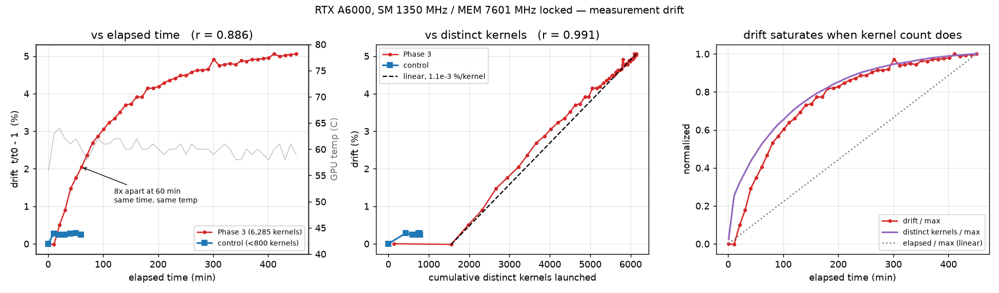

# 다중 시간 측정 드리프트 — RTX A6000

**요약.** 클럭을 고정하고 온도가 평형에 도달한 뒤에도, 같은 커널·같은 형상의
측정값이 7.5 시간에 걸쳐 **+5.06 %** 느려졌다. 열이 원인이라고 가정했고,
그 가정은 **실험으로 기각됐다.** 드리프트는 경과 시간이 아니라 **그 프로세스가
지금까지 실행한 서로 다른 커널의 누적 개수**를 따라간다.

이 문서는 관찰 → 잘못된 가설 → 기각 → 판별 실험 → 대책 순서로 적는다.
다른 GPU 에서 재측정할 때는 `docs/post_measurement.md` 10 절의 절차를
먼저 돌려야 한다 — **드리프트의 크기도 대책의 주기도 하드웨어에 의존한다.**

---

## 1. 관찰

Phase 3 본 측정 중 10 분마다 기준 config 하나를 재측정했다
(`sm86_tb128x64x32_w64x32x32_st6_swid8_a888`, 4096³, `results/drift.jsonl`).

| 경과 | ref (ms) | 드리프트 | 온도 |
|---:|---:|---:|---:|
| 0.8 분 | 2.8539 | — | 56 °C |
| 10.8 분 | 2.8534 | −0.02 % | 63 °C |
| 60.8 분 | 2.9123 | **+2.05 %** | 60 °C |
| 180.9 분 | 2.9723 | **+4.15 %** | 60 °C |
| 300.9 분 | 2.9941 | **+4.91 %** | 59 °C |
| 451.0 분 | 2.9982 | **+5.06 %** | 59 °C |

측정 조건은 그대로였다:

* SM 클럭 1350 MHz 고정, 메모리 클럭 7601 MHz (P2 상한) — 전 구간 변동 없음
* `clocks_event_reasons.active = 0x0` — 스로틀 없음
* 코어 온도는 **5 분이면 60 °C 부근에서 평형**, 이후 450 분 동안 ±3 °C
* 전력 150~230 W (A6000 한계 300 W)

즉 **온도는 진작 평평한데 성능은 계속 느려진다.** 재현성 자체는 좋았다
(같은 시점 반복 측정의 중앙값 편차 0.04 %). 느리게, 단조롭게, 확실하게
움직이는 신호다.

13 시간 유휴(46 °C) 후 재측정하면 +0.29 % 로 **완전히 되돌아온다.** 가역적이다.

## 2. 잘못된 가설 — 느린 열용량

첫 가설은 이랬다. *코어 온도는 5 분이면 평형이지만, 메모리 모듈이나 기판의
열용량은 훨씬 크다. 그쪽이 몇 시간에 걸쳐 달아오르면서 DRAM 타이밍이 조금씩
나빠지는 것이다.* 가역성(유휴 후 회복)도 이 가설에 잘 맞았다.

그래서 D-1 을 구현했다 — 본 측정 전에 **실부하로 소킹**하고, 온도가 아니라
기준 config 의 측정값 자체로 평형을 판정한다 (`scripts/rehearse.py` 의
`thermal_soak`).

### 기각

구현한 뒤 검증했다. **30 분간 69 °C / 230 W 로 소킹**했다 — Phase 3 정상
구간(60 °C / 155 W)보다 확실히 뜨겁고 전력도 높다. 열이 원인이라면 소킹 후
측정에서도 같은 상승 곡선이 나와야 한다.

**결과: −0.07 %.** 나오지 않았다.

가설이 틀렸다. 관찰은 맞았고 해석이 틀렸다.

| | 온도 | 전력 | 시간 | distinct 커널 | 드리프트 |
|---|---:|---:|---:|---:|---:|
| 소킹 (기준 config 반복) | **69 °C** | **230 W** | 30 분 | ~1 | **−0.07 %** |
| Phase 3 (실제 패턴) | 61 °C | 157 W | 10 분 | 1,556 | +0.50 %/10분 |

**더 뜨겁고 더 센 쪽이 드리프트가 없다.** 열로는 이 표를 설명할 수 없다.

그리고 이 표에는 답이 이미 들어 있었다. 소킹은 **기준 config 하나만
반복**한다 — 나도 모르는 사이에 "커널 수를 1 로 묶은 대조군" 을 돌린
것이었다. 그때는 온도만 보고 있어서 그 열을 읽지 못했다.

> 이때 내 실험 설계에 있던 결함도 같이 드러났다. "13 시간 유휴 후 회복"
> 실험은 **새 프로세스로** 측정했다. 그러면 냉각과 프로세스 재시작이 같이
> 일어나므로 회복의 원인을 냉각으로 돌릴 근거가 없었다. 가역성은 열의
> 증거가 아니라 **프로세스 상태의 증거**였을 수 있다.

## 3. 판별 — 무엇에 비례하는가

### 먼저 제거된 후보

드리프트는 **450 분 내내 단조 증가**한다. 그러니 일찍 포화하는 것은 원인일 수
없다. 이 기준만으로 대부분이 떨어져 나간다.

| 후보 | 실측 | 판정 |
|---|---|---|
| SM 클럭 | 1350 MHz, 전 구간 변동 없음 | ✗ |
| 메모리 클럭 | 7601 MHz, 전 구간 변동 없음 | ✗ |
| 스로틀 | `clocks_event_reasons.active = 0x0` 내내 | ✗ |
| 코어 온도 | 5 분에 평형, 이후 ±3 °C | ✗ |
| 열 축적 (느린 열용량) | 69 °C/230 W 소킹 후 −0.07 % | ✗ (2 절) |
| 버퍼 재할당 (`Buf::ensure`) | 고수위 방식. **10 분에 5 회 성장 후 정지** | ✗ |
| distinct 형상 | 66 개 전부 **10 분 안에** 등장 | ✗ |
| 누적 측정 행 | 시간에 선형(≈500 행/분)인데 드리프트는 아님 | ✗ |

남는 것은 둘이다 — **경과 시간**과 **누적 distinct 커널 수**.

### 남은 둘

| 후보 | 드리프트와의 상관 |
|---|---:|
| 경과 시간 | r = 0.886 |
| 누적 측정 행 수 (= 총 작업량) | r = 0.895 |
| **누적 distinct 커널 수** | **r = 0.991** |

Phase 3 안에서는 이 셋이 모두 단조 증가하므로 상관계수만으로는 못 가린다.
그래서 **곡선의 모양**과 **기울기의 안정성**을 본다.

누적 측정 행은 시간에 거의 선형이고(≈500 행/분) 드리프트는 시간에 선형이
아니다 — 작업량은 여기서 탈락한다. 반면 distinct 커널 수는 드리프트와
**같은 포화 곡선**을 그린다 (그림 오른쪽 패널).

기울기를 보면 더 분명하다.

| 구간 | 커널당 기울기 | 분당 기울기 |
|---|---:|---:|
| 21~31 분 | 1.15 m%/커널 | 0.0397 %/분 |
| 51~61 분 | 1.04 m%/커널 | 0.0287 %/분 |
| 111~121 분 | 0.66 m%/커널 | 0.0108 %/분 |
| 231~241 분 | 1.06 m%/커널 | 0.0072 %/분 |

**커널당 기울기는 ~1.1 × 10⁻³ %/커널로 거의 일정하고, 분당 기울기는 23 배
변한다.** 드리프트는 distinct 커널 수 1,556 개 지점부터 6,143 개까지
거의 완전한 직선이다 (그림 가운데 패널).

### 대조 실험 — 시간은 흐르되 커널은 늘지 않게

같은 셔플 구조로 모의 작업을 돌리되 **distinct 커널을 800 개 이하로 묶었다.**

| 경과 | 대조군 드리프트 | distinct 커널 | 같은 시각의 Phase 3 |
|---:|---:|---:|---:|
| 10 분 | +0.28 % | 427 | −0.02 % (1,556 커널) |
| 20 분 | +0.25 % | 599 | +0.50 % (1,976 커널) |
| 30 분 | +0.25 % | 694 | +0.90 % (2,321 커널) |
| 40 분 | +0.28 % | 749 | +1.47 % (2,666 커널) |
| 50 분 | +0.29 % | 778 | +1.76 % (2,945 커널) |
| **60 분** | **+0.25 %** | **790** | **+2.05 % (3,222 커널)** |

대조군은 초기에 +0.25 % 올라간 뒤 **60 분 내내 평평하다.** 시간은 똑같이
흘렀고 온도도 같았다(63~65 °C). 같은 경과 시간에 드리프트가 **8 배** 다르다.
다른 것은 그 프로세스가 지금까지 실행한 서로 다른 커널의 수뿐이다.

> 대조군의 +0.25 % 초기 상승은 Phase 3 의 곡선과 같은 직선 위에 있지 않다
> (Phase 3 는 커널 1,556 개에서 드리프트가 0 이었다). 즉 이 0.25 % 는
> 별개의 초기 과도 현상으로 보이며, 중요한 것은 **그 뒤로 더 오르지
> 않았다**는 점이다.

### 판별 실험 — 커널만 늘리고 시간은 흐르지 않게

대조군은 "시간은 흐르되 커널은 안 늘어나는" 쪽을 봤다. 반대쪽도 필요하다.

각 커널을 아주 작은 문제(256³)로 **한 번씩만 터치**하면 그 모듈의 디바이스
로드만 유발하고 넘어갈 수 있다. 그러면 몇 분 안에 수천 개를 건드린다.
`cudaMemGetInfo` 로 여유 메모리도 같이 기록했다.

| 경과 | 터치한 커널 | 드리프트 | 여유 메모리 | 온도 |
|---:|---:|---:|---:|---:|
| 0.0 분 | 0 | +0.00 % | 48,076 MB | 61 °C |
| 0.7 분 | 1,000 | +0.12 % | −144 MB | 52 °C |
| 1.9 분 | 2,000 | +0.81 % | −172 MB | 48 °C |
| 3.1 분 | 2,500 | +1.82 % | −186 MB | 47 °C |
| 3.8 분 | 2,750 | +3.65 % | −194 MB | 46 °C |
| 11.8 분 | 4,250 | +7.17 % | −234 MB | 44 °C |
| 13.6 분 | 4,500 | **+7.60 %** | −244 MB | **44 °C** |

**14 분 만에 +7.60 %.** Phase 3 은 같은 크기에 도달하는 데 7.5 시간이 걸렸고,
대조군은 60 분 동안 +0.25 % 였다. 경과 시간으로는 이 표의 어느 줄도 설명되지
않는다.

그리고 **온도는 61 °C → 44 °C 로 떨어지는 동안 드리프트가 올라갔다.** 터치가
256³ 짜리라 부하가 가벼워 GPU 가 식는데 성능은 계속 나빠진다. 두 변수가
**반대 방향**으로 움직인다 — 소킹 실험보다 강한 반증이다.

기전도 같이 잡혔다.

* **여유 메모리가 커널당 약 80 KB 씩 단조 감소한다.** 디바이스 모듈 로드의
  서명이다. 이 패턴을 만들 다른 것이 없다.
* **모듈 로드 자체가 느려진다.** 250 개를 터치하는 데 처음에는 0.17 분,
  4,250 개 지점에서는 1.66 분 — **9 배**. 모듈 테이블 조회가 O(n) 이거나
  할당이 단편화되고 있다는 뜻이다.

CUDA 12.4 는 모듈 로딩이 기본 **LAZY** 다. `rehearse.py` 는 6,285 개 `.so` 를
시작할 때 전부 dlopen 하지만, 그건 호스트 쪽 등록일 뿐이다. **디바이스에
모듈이 올라가는 것은 각 커널의 첫 런치 때 하나씩** 일어난다. 셔플된 루프가
진행될수록 누적되고, 그 수가 곧 드리프트다.

## 4. 편향은 균일하지 않다 — 이게 대책을 정한다

드리프트가 **모든 config 에 같은 비율**로 걸린다면 순위는 보존되고, 표는
쓸 수 있다. 그래서 커널 4 개 x 형상 3 개를 같이 쟀다.

터치 2,500 개 시점 (LAZY):

| 프로브 | 기준값 | 드리프트 |
|---|---:|---:|
| 작은타일 @512³ | 0.0154 ms | **+598.75 %** |
| 저smem @512³ | 0.0174 ms | +517.46 % |
| 큰타일/스필 @512³ | 0.169 ms | +30.91 % |
| 작은타일 @2048³ | 0.384 ms | +13.87 % |
| 큰타일/스필 @4096³ | 20.48 ms | +4.15 % |
| 코드최대/스필 @4096³ | 22.04 ms | +5.74 % |

**15 us 커널은 +599 %, 22 ms 커널은 +5.7 %.** 100 배 차이다. 균일하지 않다.

### 성분 분해

절대 증가량으로 보면 정체가 드러난다. 터치 2,500 → 3,500 사이의 증가분:

| 프로브 | 기준(ms) | 증가분 |
|---|---:|---:|
| 작은타일@512 | 0.0154 | +85 us |
| 작은타일@2048 | 0.384 | +42 us |
| 작은타일@4096 | 2.80 | +40 us |
| 큰타일@512 | 0.169 | +42 us |
| 큰타일@2048 | 2.29 | +43 us |
| 큰타일@4096 | 20.48 | +47 us |

기준값이 **1,400 배** 차이나는데 증가분은 거의 같다. 배수 편향이 아니라
**런치당 상수 오버헤드**다 — 모듈 1,000 개당 약 42 us.

상수이므로 긴 커널에서는 안 보이고 짧은 커널을 통째로 삼킨다. 터치 4,000 개
지점에서 512³ 프로브 네 개는 전부 0.23~0.28 ms 로 수렴한다 — 원래 시간이
0.015 ms 인 것도, 0.169 ms 인 것도. **그 시점의 512³ 측정은 커널이 아니라
런치 경로를 재고 있다.**

### 폐기 결정이 다시 정당화된다

Phase 3 의 드리프트 감시는 **4096³ 커널 하나**로만 했다. 그래서 +5.06 % 로
보였다. 같은 조건에서 512³ 측정은 수백 % 오염되어 있었고 **감시 지표에는
전혀 잡히지 않았다.** 감시 설계의 결함이다.

그래서 `DRIFT_SHAPES` 에 512³ 을 넣었다. 앵커 커널에도 짧은 커널을 반드시
포함한다 — 큰 커널만 쓰면 같은 실수를 반복한다.

### `CUDA_MODULE_LOADING=EAGER` 는 대책이 못 된다

두 가지 이유로 탈락했다.

1. **효과가 없었다.** dlopen 시간이 LAZY 와 같은 2.8 초였고(전부 미리
   올렸다면 훨씬 길어야 한다), 여유 메모리도 같은 속도로 줄었으며,
   드리프트도 거의 같았다 (터치 2,500 에서 +553 % vs LAZY +599 %).
   `Ctx` 를 dlopen 보다 먼저 만들어서 그 뒤 등록된 fatbin 은 여전히 지연
   로드된 것으로 보인다. 순서를 바꾸면 동작할 수도 있다 — 확인하지 않았다.
2. **동작했어도 쓸 수 없다.** EAGER 는 드리프트를 없애는 게 아니라 **처음부터
   최대 압력으로 고정**한다. 편향이 균일하면 그것도 괜찮지만, 위에서 봤듯이
   100 배 갈린다. 작은 형상의 config 순위가 통째로 왜곡된 표를 얻게 된다.

## 5. 대책 — 시간 분할 세그먼트

<!-- COUNTERMEASURE -->

## 6. 다른 GPU 에서는

이 문서의 수치는 **A6000 전용이다.** 1.1 m%/커널 도, 6,285 개라는 커널 수도,
+5 % 라는 총량도 그대로 옮겨 쓸 수 없다. 새 GPU 에서 Phase 3 를 켜기 전에
`docs/post_measurement.md` 10 절의 드리프트 프로파일(2~3 시간)을 먼저 돌리고,
거기서 나온 값으로 대책 주기를 정한다.

건너뛰면 어떻게 되는지는 이미 안다 — A6000 에서 **226,211 행(전체의 23 %)을
버렸다.**

---

## 7. 왜 이제까지 안 보였나

대부분의 GPU 벤치마크는 **커널 몇 개를 몇 분** 돌린다. 그 범위에서는 이
현상이 보이지 않는다 — 커널 1,500 개 아래에서는 드리프트가 0 이었고,
대조군은 커널 800 개로 60 분을 돌아도 +0.29 % 에서 평평했다.

이 현상이 드러나려면 **수천 개의 서로 다른 커널을 한 프로세스에서 순회**해야
한다. 그건 정확히 오토튜닝 데이터 수집의 모양이다. 그리고 CUDA 12.x 의 LAZY
모듈 로딩은 시작 시간과 메모리를 아끼려는 최적화인데, 이 워크로드는 그
최적화가 상정한 패턴이 아니다 — 모듈을 올리기만 하고 거의 내리지 않는다.

즉 **이 조건은 오토튜닝 데이터 수집에서만 성립한다.** 그렇다면 기존 오토튜닝
데이터셋들도 같은 오염을 안고 있을 가능성이 있다. 측정 순서에 상관된 편향은
"먼저 측정된 config 가 이긴다" 는 형태로 나타나므로, 셔플을 했더라도 각
config 의 절대 시간에는 남는다.

다만 이건 **A6000 한 대에서 관찰한 것이고, 다른 하드웨어·드라이버·프레임워크로
일반화하려면 재현이 필요하다.** 여기서는 가능성을 기록만 해 둔다.
